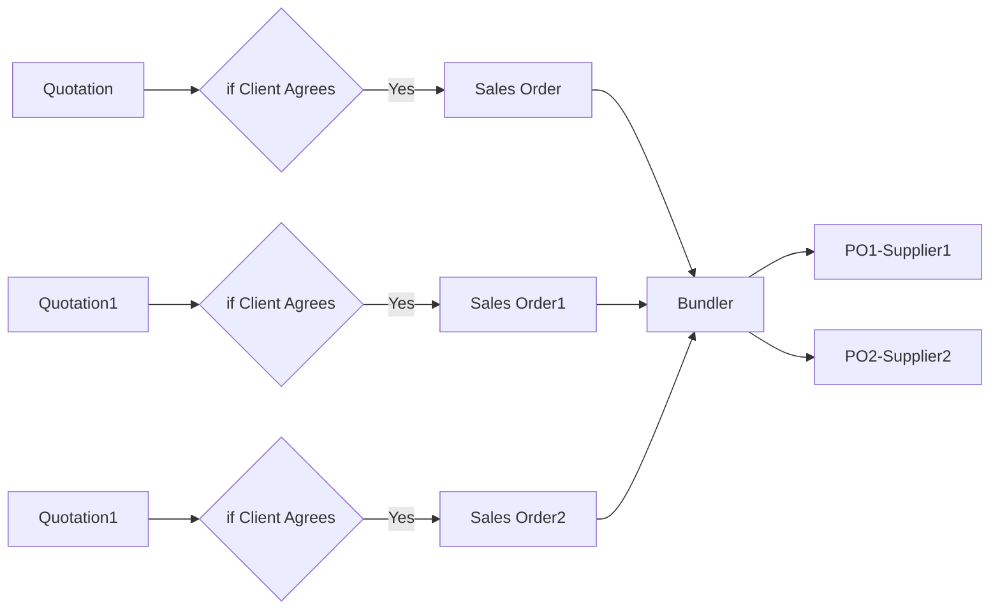

# GeneralInfo
All general Information will be available here

# Important URL's
 - [Edit MD Files](https://stackedit.io/app#) - https://stackedit.io/app#
 - [Ryver Team Management](https://reachdigital.ryver.com)-https://reachdigital.ryver.com
 - [react-online-editor](https://stackblitz.com/edit/react-lvtwhw)-https://stackblitz.com/edit/react-lvtwhw
 - [JS-online-editor](https://jsbin.com/?js,output)- https://jsbin.com/?js,output
 
 # Why this team
1. Software Engineer
2. Solving Problems
3. Managing Team 
4. Study Circuit
5. Keeping up with technologies

# 22nd Jul 2018 Agenda
1. Show this page
2. Explain Ryver
3. Add team members to the Ryver
4. Add team members to Git Hub
5. Explain Git Hub
6. Explain VS code( make them to create a new commit)
7. Explain Java script
8. Explain Node.js
9. Explain React.js
10. Explain Mongo DB
11. Explain Reach-MMS

## check this in stack edit link

